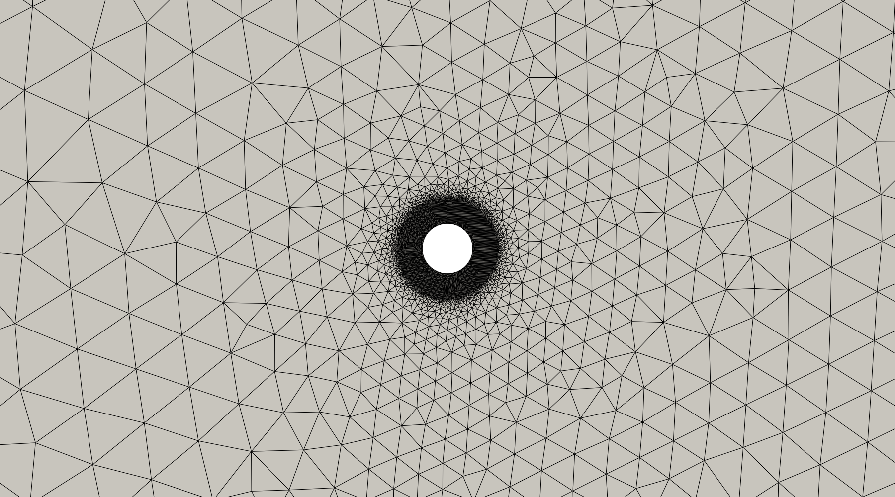
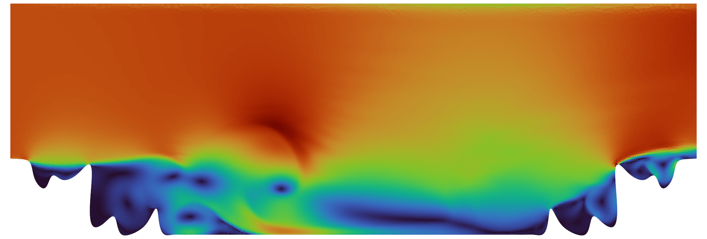
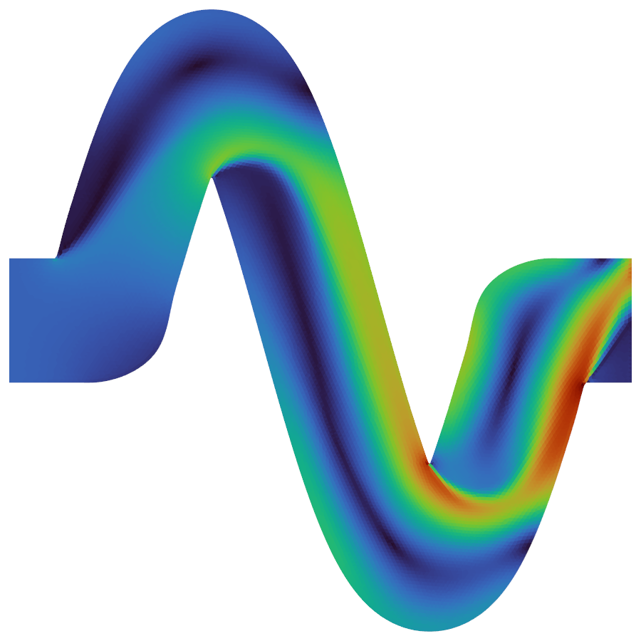

# AutoFOAM — The Self-Refining Autonomous OpenFOAM Agent

A self-evolving LLM-driven OpenFOAM v2412 case-authoring agent.

> **Paper:** *AutoFOAM: The Self-Refining Autonomous OpenFOAM Agent* — Arun Govind Neelan & A Seshaditya  
> **Model weights:** [arungovindneelan/foam-cfd-unified-14b-private](https://huggingface.co/arungovindneelan/foam-cfd-unified-14b-private)  
> **Dataset:** [AGN000/FoamAgentCases](https://github.com/AGN000/FoamAgentCases)  
> **Demo:** [▶ Watch on YouTube](https://www.youtube.com/watch?v=Kx17bfFlMSc)

This is the v3 codebase covering the seven-layer self-evolution loop and
the three explicit anti-collapse defenses described in the accompanying
arXiv paper.

---

## Automatically Generated Meshes

All meshes are produced fully autonomously from a single natural-language prompt via the `gmsh` OCC API — no manual CAD work.

| NACA-4-digit Airfoil | Cylinder in Cross-flow |
|:---:|:---:|
|  |  |

| Periodic Hill (Mellen Polynomial) | S-bend Duct |
|:---:|:---:|
|  |  |

---

## Velocity Contours — Autonomous Flow Solutions

Velocity magnitude fields computed end-to-end with zero manual intervention. AutoFOAM correctly assigns `polyMesh` boundary names, selects the appropriate solver, and produces convergent solutions.

| NACA-4-digit Airfoil | Cylinder in Cross-flow |
|:---:|:---:|
|  |  |

| Periodic Hill | S-bend Duct |
|:---:|:---:|
|  |  |

---

## Layout

```
openfoam_agent/        # importable package — agent core
├── agent.py           # 8-stage pipeline + Layer-1 retry orchestrator
├── self_correct.py    # NEW (Layer 1) — structured failure signals + retry context
├── dict_fix.py        # NEW (Stream B) — surgical FOAM-FATAL dict-level fix
├── param_extractor.py # JSON-schema-constrained CFDParams extraction
├── solver_selector.py # deterministic 7-solver rule table
├── numerical_policy.py# y+-aware schemes/relaxation/tolerances
├── case_writer.py     # OpenFOAM dict templates (deterministic)
├── gmsh_generator.py  # 13 parametric mesh templates (gmsh OCC API)
├── runner.py          # OpenFOAM solver subprocess + log parser
├── scorer.py          # multi-component reward function
├── failure_diagnosis.py # FATAL classifier + retry-context builder
├── prompt_refiner.py  # LLM paraphrase pass
├── prompt_catalog.py  # 252 hand-authored seed prompts
├── rag.py             # TutorialRAG (chroma) + Stream-A retrieve_with_content
├── training.py        # Qwen-chat formatter + reward-weighted SFT trainer factory
├── schemas.py         # Pydantic CFDParams / RunResult / AgentResult / TrainingExample
├── knowledge_base.py  # in-house knowledge entries
└── config.py          # paths + LLM/eval/evolution knobs

scripts/               # operational tooling
├── train_qlora.py     # QLoRA SFT
├── train_dpo.py       # NEW (Layer 4) — DPO on retry pairs
├── merge_adapter.py   # bf16 merge for vLLM
├── curate_dataset.py  # NEW (Layer 2 + Layer 5 anchor mix) — corpus curator
├── active_learning.py # NEW (Layer 6) — weakest-family targeted prompt synth
├── regression_diff.py # NEW (Layer 7) — per-prompt baseline-vs-candidate gate
├── evolve.sh          # NEW — orchestrates all 7 layers end-to-end
├── full_test_parallel.py # 8-way sharded OOD eval (now with --with-files)
├── ask.sh / repl.py / repl.sh # interactive CLIs
├── generate_training_data.py
├── build_hf_dataset.py
├── index_tutorials.py / index_knowledge_base.py
├── extract_external_cases.py
├── validate_rag_pipeline.py
├── test_inference.py
├── run_agent.py
└── run_full_test_parallel.sh / run_pipeline.sh / run_test_inference.sh
```

## The seven-layer self-evolution loop

| Layer | File | What it does |
|-------|------|--------------|
| **L1** | `openfoam_agent/self_correct.py` | In-run self-correction: parses RunResult for divergence/NaN/FP/mass-imbalance, retries with enriched failure context. Captures every attempt to `data/dataset/attempts.jsonl`. |
| **L2** | `scripts/curate_dataset.py` | Auto-curation: dedup by (prompt, solver, params hash); drop rows below `MIN_RETRAIN_SCORE`; emit Qwen-chat JSONL ready for trainer. |
| **L3** | `scripts/evolve.sh` (steps 2-4) | SFT corrective epoch + bf16 merge + 8-way sharded OOD eval gate vs `data/eval/regression_gate.json`. |
| **L4** | `scripts/train_dpo.py` | DPO on `(prompt, chosen, rejected)` triples mined from `attempts.jsonl`. Gated by `--min-pairs 50` (default). |
| **L5** | `curate_dataset.py --anchor` | Anchor mixing: 30% v1 corpus rows preserved each cycle to prevent forgetting. |
| **L6** | `scripts/active_learning.py` | Targets weakest solver family from previous eval; LLM-authors paraphrased prompts; runs them through agent; appends high-score rows to next cycle's corpus. `--adversarial` mode produces tricky prompts that trigger Layer-1 retries (DPO pair generation). |
| **L7** | `scripts/regression_diff.py` | Per-prompt diff vs pinned `baseline_eval_with_files.jsonl`: SUCCESS_FLIP, SOLVER_CHANGE, SCORE_DROP > 0.10. Non-zero exit blocks promotion. |

Streams A (RAG-with-content into retry) and B (surgical dict-level fix) live
in `openfoam_agent/rag.py` (`retrieve_with_content`, `format_content_context`)
and `openfoam_agent/dict_fix.py` respectively.

## Configuration knobs

All env-overridable via `openfoam_agent/config.py`:

| Knob | Default | Purpose |
|------|---------|---------|
| `RETRY_SCORE_THRESHOLD` | 0.7 | Score below this triggers Layer-1 retry |
| `MIN_RETRAIN_SCORE` | 0.65 | Score floor for entering training corpus |
| `EVOLUTION_BATCH_SIZE` | 25 | New high-score rows that trigger an evolve cycle |
| `EVOLUTION_ANCHOR_FRACTION` | 0.30 | Layer-5 anchor share of training mix |
| `EVOLUTION_ACTIVE_LEARNING` | 1 | Layer-6 enable flag |
| `ACTIVE_LEARNING_THRESHOLD` | 0.95 | Family match-rate below this → trigger active learning |
| `VLLM_GPU_MEM_FRAC` | 0.85 | vLLM GPU memory fraction |
| `VLLM_MAX_NUM_SEQS` | 256 | vLLM concurrency |

## Running the loop

```bash
# One-off interactive run
bash scripts/ask.sh "2D lid-driven cavity Re=1000, 2 m square, water"

# Long-running REPL with persistent vLLM
bash scripts/repl.sh

# 8-way sharded OOD evaluation
bash scripts/run_full_test_parallel.sh

# Full self-evolution cycle (curate → SFT → DPO → merge → eval gate → diff → swap)
bash scripts/evolve.sh                 # production
EVOLVE_DRY_RUN=1 bash scripts/evolve.sh  # validate without swap
```

## Model

Weights available at HuggingFace: [arungovindneelan/foam-cfd-unified-14b-private](https://huggingface.co/arungovindneelan/foam-cfd-unified-14b-private).

The earlier public 14B (`arungovindneelan/foam-cfd-unified-14b`) is the
v2 baseline; this repo holds the v3 cycle-2 candidate produced
by the active-learning + anchor-mix loop.

---

## Deployment

### Prerequisites

| Requirement | Notes |
|-------------|-------|
| OpenFOAM v2412 | Must be sourced before running any simulation |
| Python ≥ 3.10 | With `vllm`, `unsloth`, `gmsh`, `chromadb`, `pydantic` |
| NVIDIA GPU | ≥ 24 GB VRAM recommended (14 B model at bf16) |
| HuggingFace account | Access request needed for the private weights repo |

### 1. Download the model weights

```bash
pip install huggingface_hub
huggingface-cli login          # paste your HF token when prompted

huggingface-cli download \
    arungovindneelan/foam-cfd-unified-14b-private \
    --local-dir /data/foamllm3/openfoam_agent/data/checkpoints/qwen_coder_14b_merged
```

### 2. Install the package

```bash
git clone https://github.com/AGN000/AutoFOAM.git
cd AutoFOAM
pip install vllm unsloth gmsh chromadb pydantic sentence-transformers
```

### 3. Point the agent at your model

The model path is read from `openfoam_agent/config.py`. Either edit `LLM_MODEL` directly, or use the environment variable override (no file edit needed):

```bash
export OPENFOAM_AGENT_LLM_OVERRIDE=/path/to/your/qwen_coder_14b_merged
```

### 4. Source OpenFOAM

```bash
source /path/to/openfoam2412/etc/bashrc
# e.g. source /usr/lib/openfoam/openfoam2412/etc/bashrc
```

Update `OPENFOAM_BASHRC` in `openfoam_agent/config.py` to match your installation path so the agent can source it automatically at runtime.

### 5. Build the RAG index (first run only)

```bash
python scripts/index_tutorials.py      # index OpenFOAM tutorials
python scripts/index_knowledge_base.py # index in-house knowledge entries
```

---

## Usage

### Interactive REPL (recommended)

Loads the 14 B model once and accepts prompts in a loop — no reload between runs.

```bash
bash scripts/repl.sh
# or pin to a specific GPU:
GPU=0 bash scripts/repl.sh
```

```
prompt> 2D lid-driven cavity Re=1000, 2m square, water
prompt> NACA0012 airfoil AoA 5 deg Re=1e6 chord=1m
prompt> turbulent pipe flow Re=50000 diameter=0.05m length=0.5m
prompt> quit
```

REPL commands:

| Command | Effect |
|---------|--------|
| `last` | Re-print the last result |
| `cases` | List the 10 most recent case directories |
| `timeout=N` | Set solver timeout in seconds (default 300) |
| `retries=N` | Set max self-correction retries (default 1) |
| `quit` / Ctrl-D | Exit |

### One-off run

```bash
bash scripts/ask.sh "2D lid-driven cavity Re=1000, 2m square, water"
```

### Python API

```python
from openfoam_agent.agent import OpenFOAMAgent

agent = OpenFOAMAgent(use_llm=True)

# Single prompt
result = agent.run(
    "turbulent flow over a backward-facing step Re=800, step height 0.1m",
    max_retries=3,       # Layer-1 self-correction attempts
    sim_timeout=300,     # solver wall-clock limit in seconds
)

print(result.success)   # True / False
print(result.score)     # 0.0 – 1.0
print(result.solver)    # e.g. "simpleFoam"
print(result.case_dir)  # path to generated OpenFOAM case
print(result.feedback)  # human-readable scoring breakdown

# Batch run
prompts = [
    "2D lid-driven cavity Re=100",
    "Flow around cylinder Re=200 diameter=0.1m",
    "Turbulent channel flow Re=10000",
]
results = agent.run_batch(prompts, max_retries=2, sim_timeout=300)
for r in results:
    print(f"{r.score:.2f}  {r.solver}  {r.feedback}")
```

### Key environment variables

| Variable | Default | Effect |
|----------|---------|--------|
| `OPENFOAM_AGENT_LLM_OVERRIDE` | *(config.py value)* | Override model path without editing config |
| `VLLM_GPU_MEM_FRAC` | `0.85` | Fraction of GPU memory reserved for vLLM |
| `VLLM_MAX_NUM_SEQS` | `256` | vLLM max concurrent sequences |
| `RETRY_SCORE_THRESHOLD` | `0.7` | Score below this triggers Layer-1 retry |
| `MIN_RETRAIN_SCORE` | `0.65` | Floor score for entering the training corpus |
| `EVOLVE_DRY_RUN` | *(unset)* | Set to `1` to validate evolve.sh without swapping the model |
